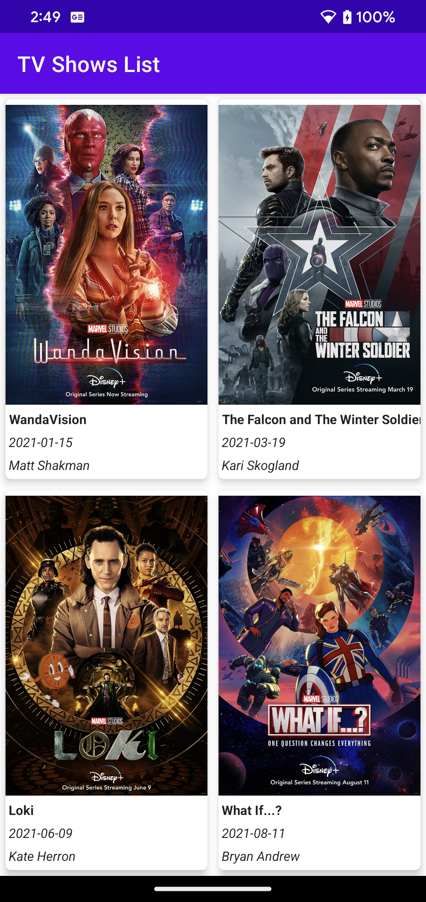

# Description

This is an application that retrieves a list of TV shows from a remote data source, stores them in a local database, and displays in the list.

https://mcuapi.herokuapp.com/api/v1/tvshows

An example of the response can be found [here](response.json)

# Libraries Used
* Retrofit - Retrofit as a REST Client library
* Gson - Gson converter as a Retrofit response mapping library
* Hilt - Dependency injection
* Navigation - Jetpack's navigation component

# Android components
* RecyclerView - Used to list the Albums.
* Constraint layout - Simple, flat hierarchies in a layout.
* Coroutines – For Asynchronous or non-blocking programming
* Flow - Handle streams of data asynchronously
* View binding – To bind the data with the UI and to improve the performance, prevent memory leaks and null pointer exceptions.

# Android Architecture Components (Android Jetpack)
* ViewModel - Allows data to survive configuration changes such as screen rotations.
* LiveData - Lifecycle-aware data holder class to respects the lifecycle Fragments.
* AndroidX - Complete project implemented using AndroidX libraries.
* Room database for data persistence.

# Design
* The application is developed with TDD and MVVM design pattern.

# Further enhancements
* Handle configuration changes
* Furthermore cosmetics and refactoring is an endless thought.

# Snapshots

